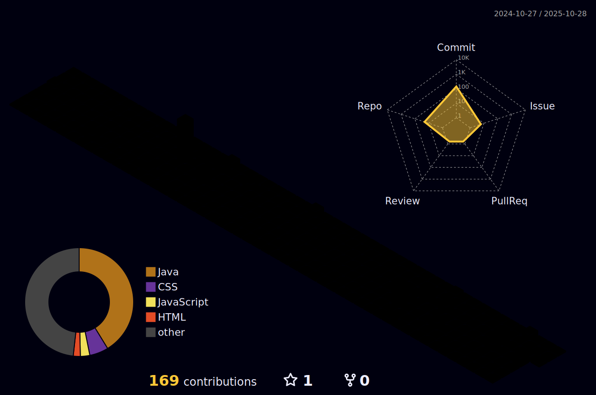

<h1 align="center">Daniel Maciel Benício</h1>

  Dev · TI · Design

---

---
##

 

## Sobre

- Atualmente cursando Análise e Desenvolvimento de Sistemas
- SENAI Suíço-Brasileira

## Contato

- [LinkedIn](https://www.linkedin.com/in/daniel-maciel-benicio/)
- [Portfólio](Em construção - em breve...)
- [Instagram - Daniel](https://www.instagram.com/danxzs._)

---
